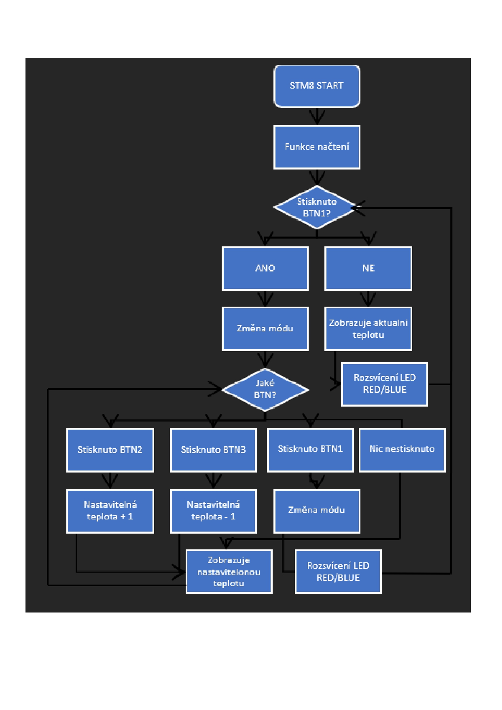
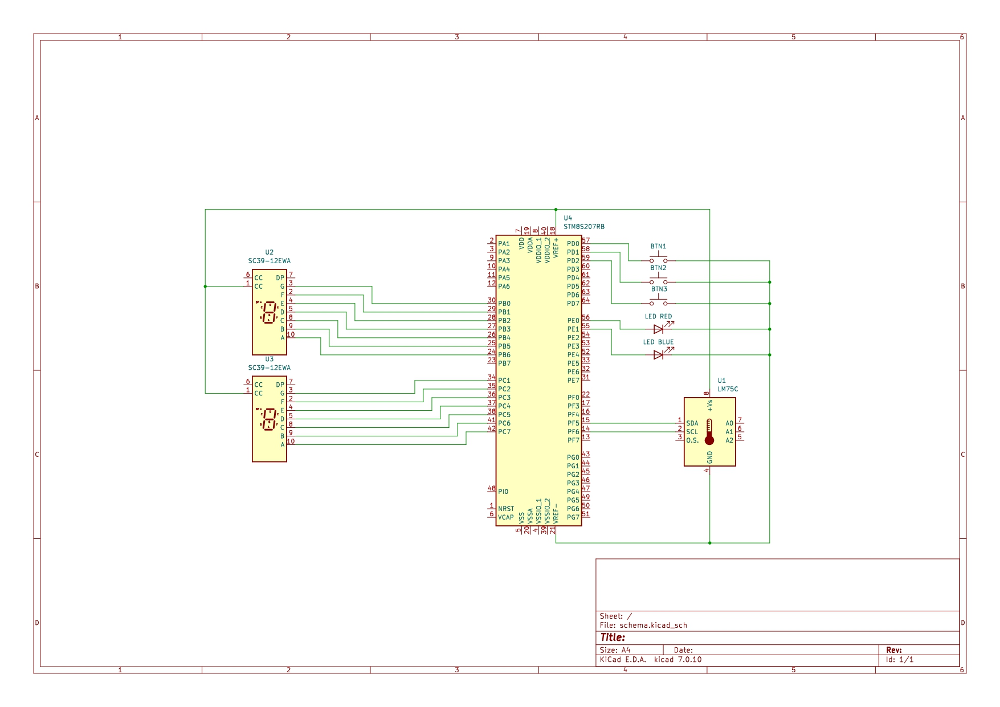

# Systém pro teplotní regulaci

Tento projekt je systém pro zobrazování a řízení teploty využívající mikrokontrolér STM8. Systém čte teplotní data ze senzoru CJMCU-75, zobrazuje teplotu na dvou 7-segmentových displejích a ovládá dvě LED diody na základě naměřených teplot a uživatelem definované požadované teploty.

## Funkce

- **Čtení teploty**: Čte teplotu ze senzoru CJMCU-75 přes I2C.
- **Zobrazení teploty**: Zobrazuje aktuální teplotu na 2 7-segmentových displejích.
- **Nastavení požadované teploty**: Umožňuje uživateli nastavit požadovanou teplotu pomocí tlačítek.
- **LED indikátory**: Ovládá dvě LED diody (červenou a modrou) na základě aktuální teploty v porovnání s nastavenou požadovanou hodnotou.

## Hardware

- STM8 mikrokontrolér
- Teplotní sezor CJMCU-75
- Dvě 7-segmentové displeje
- Tři tlačítka (BTN1, BTN2, BTN3)
- Dvě LED diody (červená a modrá)

## Využitý operační systém

- Linux (Osobně jsem využil virtuální prostředí pomocí virtual boxu.)

  ## Hlavní Smyčka

Hlavní smyčka programu `main()` provádí následující kroky:

1. **Čtení aktuální teploty**: Program na začátku smyčky čte aktuální teplotu z teplotního senzoru CJMCU-75.

2. **Získání aktuálního módu**: Zjišťuje se aktuální mód, který je 0 nebo 1.

3. **Zobrazení teploty nebo nastavení požadované teploty**: Podle aktuálního módu se buď zobrazuje aktuální teplota na 7-segmentech, nebo se zobrazuje požadovaná teplota na 7-segmentech, kterou je možno upravovat pomocí tlačítek BTN2 a BTN3.

4. **Řízení LED diod**: LED diody (červená a modrá) jsou řízeny na základě porovnání aktuální teploty s nastavenou požadovanou teplotou. Například červená LED signalizuje topení, zatímco modrá LED signalizuje chlazení.

5. **Ladění pomocí UART**: Pro účely ladění a monitorování systému může být využívána komunikace pomocí UART, která umožňuje zobrazovat aktuální teplotu a diagnostické informace na sériové lince.

## Vývojový diagram

## Schéma

